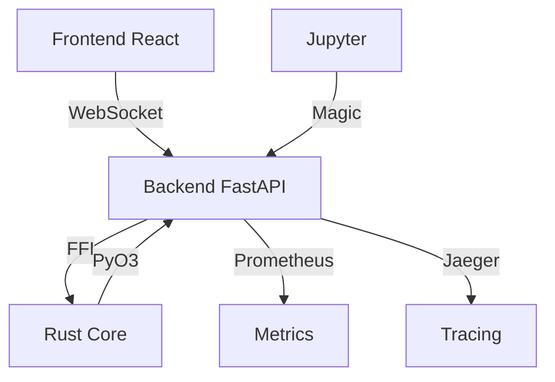

# NeuroGraph Project Structure

Полная структура проекта с описанием всех компонентов.

## 📦 Корневая структура

```
neurograph-os-mvp/
├── 🎯 Конфигурация
│   ├── .config.sh           # Главный конфигурационный скрипт
│   ├── config/              # Централизованные настройки
│   ├── .env.local.example   # Пример локальных настроек
│   └── .gitignore           # Git игнорируемые файлы
│
├── 📜 Управление
│   ├── setup-dependencies.sh  # Установка зависимостей
│   ├── start-all.sh          # Запуск всего стека
│   ├── start-backend.sh      # Запуск backend
│   ├── start-frontend.sh     # Запуск frontend
│   ├── stop-all.sh           # Остановка всех сервисов
│   └── show-config.sh        # Показать конфигурацию
│
├── 📖 Документация
│   ├── README.md             # Основная документация
│   ├── CONFIGURATION.md      # Руководство по конфигурации
│   ├── SCRIPTS.md            # Описание скриптов
│   ├── PROJECT_STRUCTURE.md  # Этот файл
│   ├── CONTRIBUTING.md       # Как помочь проекту
│   └── docs/                 # Расширенная документация
│
├── 💻 Исходный код
│   └── src/                  # См. детали ниже
│
├── 🧪 Тестирование
│   └── tests/                # Unit, integration, performance тесты
│
├── 📊 Данные
│   └── data/                 # Базы данных, JSON конфиги
│
└── 🔧 Инструменты
    ├── .venv/                # Python virtual environment
    ├── docker/               # Docker конфигурации
    └── benchmarks/           # Бенчмарки производительности
```

## 🏗️ Структура src/

```
src/
├── 🦀 core_rust/             # Rust Core (высокопроизводительное ядро)
│   ├── Cargo.toml            # Rust зависимости
│   ├── src/                  # Rust исходники
│   │   ├── lib.rs
│   │   ├── python/           # Python bindings (PyO3)
│   │   ├── signal_system/    # Система сигналов
│   │   ├── action_controller/# Контроллер действий
│   │   ├── guardian.rs       # Guardian (CDNA)
│   │   └── ...
│   └── target/               # Скомпилированные артефакты
│
├── 🐍 Python Backend
│   ├── api/                  # FastAPI REST + WebSocket
│   │   ├── main.py           # Точка входа
│   │   ├── routers/          # Эндпоинты API
│   │   ├── services/         # Бизнес-логика
│   │   ├── models/           # Pydantic модели
│   │   ├── auth/             # Аутентификация
│   │   ├── websocket/        # WebSocket интеграция
│   │   └── storage/          # Хранилища данных
│   │
│   ├── core/                 # Python Core компоненты
│   │   └── token/
│   │
│   ├── gateway/              # Сенсорный слой
│   │   ├── adapters/
│   │   ├── encoders/
│   │   └── filters/
│   │
│   ├── integration/          # Интеграция Python-Rust
│   │
│   └── neurograph_jupyter/   # Jupyter расширение
│       ├── __init__.py
│       └── display.py
│
└── ⚛️ web/                   # React Frontend
    ├── package.json          # Node.js зависимости
    ├── vite.config.ts        # Vite конфигурация
    ├── src/
    │   ├── main.tsx          # Точка входа
    │   ├── App.tsx           # Главный компонент
    │   ├── pages/            # Страницы
    │   │   ├── Dashboard.tsx
    │   │   ├── Modules.tsx
    │   │   ├── Config.tsx
    │   │   └── ...
    │   ├── components/       # Переиспользуемые компоненты
    │   ├── layouts/          # Layouts (ProLayout)
    │   ├── stores/           # Zustand state management
    │   ├── services/         # API & WebSocket клиенты
    │   ├── types/            # TypeScript типы
    │   └── utils/            # Утилиты
    └── locales/              # i18n переводы (EN/RU)
```

## 🗂️ Детальная структура config/

```
config/
├── README.md              # Описание конфигурационных файлов
├── project.env            # Проект
│   ├── PROJECT_NAME
│   ├── PROJECT_VERSION
│   ├── BACKEND_PORT
│   ├── FRONTEND_PORT
│   └── Feature flags
│
├── python.env             # Python
│   ├── VENV_PROMPT
│   ├── PIP_* настройки
│   └── PYTEST_* настройки
│
├── rust.env               # Rust
│   ├── RUST_PROFILE
│   ├── CARGO_* настройки
│   └── MATURIN_* настройки
│
└── versions.env           # Версии
    ├── PYTHON_MIN_VERSION
    ├── PYDANTIC_VERSION
    ├── FASTAPI_VERSION
    └── ...
```

## 🚀 Основные компоненты

### Backend Stack

```
FastAPI (REST + WebSocket)
    ↓
SignalPipeline (интеграция)
    ↓
Rust Core (_core PyO3 bindings)
    ↓
SignalSystem (304k events/sec)
```

### Frontend Stack

```
React 18.2
    ↓
Ant Design Pro (UI)
    ↓
Zustand (State)
    ↓
WebSocket Client
    ↓
Backend API
```

### Data Flow

```
User Input → Frontend → WebSocket → Backend → Rust Core
                           ↓
                      Processing
                           ↓
Frontend ← WebSocket ← Backend ← Results
```

## 📄 Ключевые файлы

### Конфигурация

| Файл | Назначение |
|------|------------|
| [.config.sh](.config.sh) | Главный конфиг, загружает все настройки |
| [config/project.env](config/project.env) | Основные настройки проекта |
| [config/python.env](config/python.env) | Python-специфичные настройки |
| [config/rust.env](config/rust.env) | Rust-специфичные настройки |
| [config/versions.env](config/versions.env) | Версии зависимостей |
| `.env.local` | Локальные переопределения (не в git) |

### Python

| Файл | Назначение |
|------|------------|
| [pyproject.toml](pyproject.toml) | Python метаданные и зависимости |
| [src/api/main.py](src/api/main.py) | FastAPI приложение |
| [src/integration/pipeline.py](src/integration/pipeline.py) | SignalPipeline |

### Rust

| Файл | Назначение |
|------|------------|
| [src/core_rust/Cargo.toml](src/core_rust/Cargo.toml) | Rust зависимости |
| [src/core_rust/src/lib.rs](src/core_rust/src/lib.rs) | Главный модуль |
| [src/core_rust/src/python/](src/core_rust/src/python/) | PyO3 bindings |

### Frontend

| Файл | Назначение |
|------|------------|
| [src/web/package.json](src/web/package.json) | Node.js зависимости |
| [src/web/src/App.tsx](src/web/src/App.tsx) | Главный компонент React |
| [src/web/src/stores/](src/web/src/stores/) | Zustand stores |

## 🔄 Зависимости между компонентами



## 📊 Метрики и размеры

| Компонент | LoC | Файлов | Тестов |
|-----------|-----|--------|--------|
| Rust Core | ~15k | ~50 | ~100 |
| Python Backend | ~8k | ~80 | ~150 |
| React Frontend | ~5k | ~40 | ~50 |
| **Всего** | **~28k** | **~170** | **~300** |

## 🔗 См. также

- [README.md](README.md) - Основная документация
- [CONFIGURATION.md](CONFIGURATION.md) - Руководство по конфигурации
- [SCRIPTS.md](SCRIPTS.md) - Описание скриптов
- [CONTRIBUTING.md](CONTRIBUTING.md) - Как помочь проекту
- [docs/](docs/) - Расширенная документация
