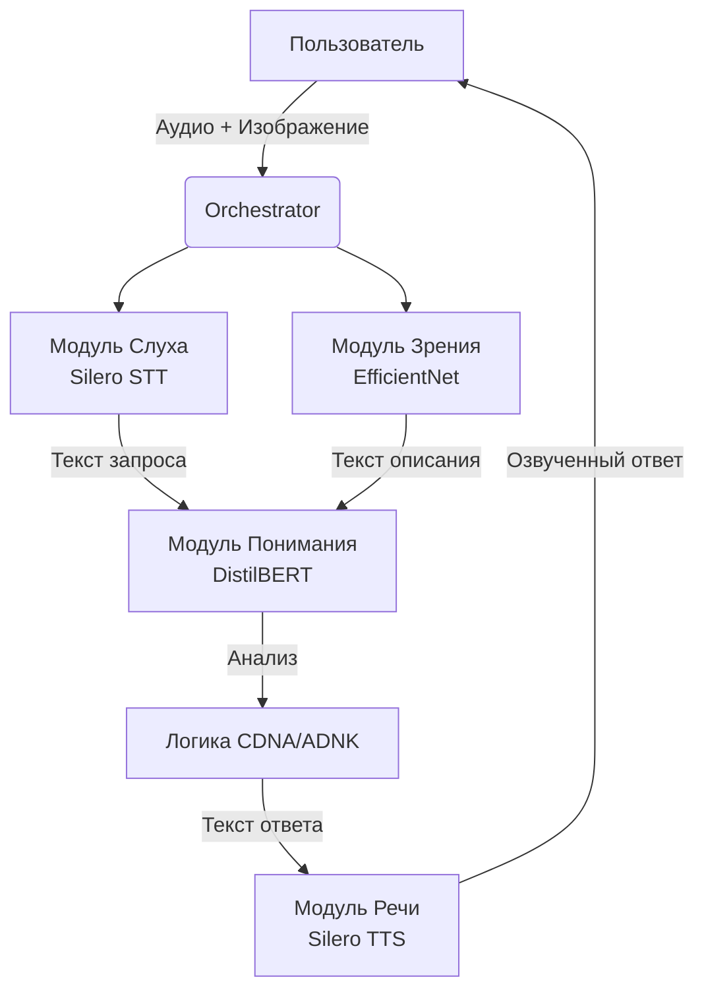

# Сессия вопросов-ответов #1
**Дата:** 2025-01-19
**Тема:** GraphEngine, полевая модель, обучение

---

## Блок 1: GraphEngine (для v0.11)

### Q1.1: Граф - структура данных

**Ответ:** Несколько решений, например B (Neo4j) + C (NetworkX)

**Интерпретация:**
- Neo4j для персистентного хранения графа
- NetworkX для работы в памяти (быстрые операции)
- Возможно гибридный подход: NetworkX загружает подграфы из Neo4j

**Примечание:** Уже была попытка реализовать Persistence - изучить старый код

---

### Q1.2: Типы связей (edge types)

**Ответ:** На разных этапах разная и для разных уровней разная

**Детали:**
- **Алфавит** необходимо разметить вручную
- **Ключевые значения** размечаются вручную
- **Поля смыслов** или часть библиотеки - вручную
- Далее - **динамически** (система создаёт новые типы)

**Интерпретация:**
Будет **два набора** типов связей:

1. **Базовые (вручную):**
   ```json
   {
     "base_edge_types": [
       "является",
       "имеет_свойство",
       "имеет_цвет",
       "часть_от",
       "причина",
       "следствие",
       ...
     ]
   }
   ```

2. **Динамические (создаются системой):**
   ```python
   # Система обнаруживает паттерн и создаёт новый тип
   new_edge_type = "часто_вместе_с"
   # или
   new_edge_type = "противоположность"
   ```

**Вопросы для уточнения:**
- Где хранятся базовые типы? В CDNA?
- Как система решает создать новый тип связи?

---

### Q1.3: Направленность связей

**Ответ:** Модуль "Сигналы" еще не проработан, но есть в проекте

**Интерпретация:**
- Вопрос о направленности откладывается
- Есть концепция модуля "Сигналы" которая это регулирует
- Нужно сначала проработать этот модуль

**Вопросы для уточнения:**
- Что такое модуль "Сигналы"?
- Он отвечает за распространение активации по графу?
- Или за что-то другое?

---

## Блок 2: Полевая модель

### Q2.1: Функция спада поля

**Ответ:** Это предположение сделанное сегодня в процессе формирования спецификации токена, как контекст для понимания каким должен быть токен и как происходит обучение

**Интерпретация:**
- Полевая модель - это **концептуальная модель**, не финальная реализация
- Она нужна для понимания принципов
- Конкретная формула спада может измениться

**Статус:** Рабочая гипотеза, требует проработки

---

### Q2.2-2.3: Наложение полей и расстояние

**Ответ:** Ответственность Декодера, который необходимо продумать и реализовать

**Интерпретация:**
- Детали вычисления полей - задача **Декодера**
- Декодер решает:
  - Как вычислять расстояние (по уровням или общее)
  - Как нормализовать наложение полей
  - Как интерпретировать результат

**Вывод:** Нужна детальная спецификация Декодера

---

## Блок 3: Создание токенов и координат

### Q3.1: Откуда берутся координаты?

**Ответ:** Координаты фиксированы на осях системы координат. Правила для каждого уровня хранятся в CDNA и обновляются по подписке. Размещением занимается Декодер.

**Детальная интерпретация:**

1. **Система координат фиксирована:**
   - 8 уровней × 3 оси = фиксированная структура
   - Диапазоны для каждого уровня строго определены

2. **Правила в CDNA:**
   ```json
   {
     "coordinate_rules": {
       "L1_physical": {
         "x_range": [-327.67, 327.67],
         "y_range": [-327.67, 327.67],
         "z_range": [-327.67, 327.67],
         "scale": 100
       },
       "L4_emotional": {
         "valence_range": [-1.0, 1.0],
         "arousal_range": [-1.0, 1.0],
         "dominance_range": [-1.0, 1.0],
         "scale": 10000
       },
       ...
     }
   }
   ```

3. **Обновление по подписке:**
   - Правила могут меняться динамически
   - Модули подписываются на изменения CDNA
   - При изменении правил - модули адаптируются

4. **Декодер размещает токены:**
   - Декодер получает запрос на создание токена
   - Декодер читает правила из CDNA
   - Декодер вычисляет координаты
   - Декодер размещает токен в пространстве

---

## Ключевое понимание: Обучение через деление полей

**Цитата:**
> "Одно из решений мне понравилось когда токен занимает все свободное место в поле и делит его с новым и т.д."

### Концепция:

**Шаг 1: Токен появляется и занимает всё доступное пространство**
```
Пустое пространство:
┌─────────────────┐
│                 │
│                 │
│                 │
└─────────────────┘

Токен "Яблоко" появляется:
┌─────────────────┐
│ ░░░░░░░░░░░░░░░ │ ← Поле токена
│ ░░░░░●░░░░░░░░░ │    расширяется на
│ ░░░░░░░░░░░░░░░ │    всё пространство
└─────────────────┘
```

**Шаг 2: Новый токен появляется → делит пространство**
```
Токен "Груша" появляется:
┌─────────────────┐
│ ░░░░░│░░░░░░░░░ │
│ ░●░░░│░░░●░░░░░ │ ← Пространство
│ ░░░░░│░░░░░░░░░ │    поделено
└─────────────────┘
  Яблоко  Груша
```

**Шаг 3: Третий токен → дальнейшее деление**
```
Токен "Банан" появляется:
┌─────────────────┐
│ ░░│░░░░│░░░░░░░ │
│ ●░│░●░░│░░●░░░░ │ ← Каждый занимает
│ ░░│░░░░│░░░░░░░ │    свою часть
└─────────────────┘
  Я  Гр   Бн
```

### Механизм деления:

**Алгоритм:**
1. Новый токен появляется
2. Находит ближайшие существующие токены
3. Вычисляет "свободное пространство" между ними
4. Занимает центр свободного пространства
5. Его поле "отталкивает" соседние поля
6. Устанавливается новое равновесие

**Математика:**
```python
def find_free_space(new_token, existing_tokens):
    """
    Найти свободное пространство для нового токена

    Алгоритм:
    1. Вычислить поле от всех существующих токенов
    2. Найти локальные минимумы (слабые поля)
    3. Выбрать минимум ближайший к контекстуальным токенам
    """

    # Сканируем пространство
    min_field_strength = float('inf')
    best_position = None

    for candidate_position in sample_space():
        # Вычисляем суммарное поле от существующих токенов
        total_field = sum(
            field_strength(
                distance(candidate_position, token.center)
            )
            for token in existing_tokens
        )

        # Ищем минимум (свободное место)
        if total_field < min_field_strength:
            min_field_strength = total_field
            best_position = candidate_position

    return best_position
```

### Почему это работает:

**1. Самоорганизация:**
- Токены автоматически находят оптимальное расположение
- Похожие токены группируются (их поля притягиваются)
- Непохожие токены расходятся (их поля отталкиваются)

**2. Динамическое пространство:**
- Пространство не фиксировано
- Оно делится по мере появления новых токенов
- Старые токены "подвигаются" освобождая место

**3. Координаты - внутреннее измерение:**
> "Координаты это внутреннее измерение токенов и, видимо, декодера/энкодера, а в остальном все пользуются ID токена поэтому это не должно стать проблемой для модели."

**Важный принцип:**
- **Внешние модули** работают с **ID токенов**
- **Координаты** используют только **Декодер/Энкодер/Navigator**
- Остальные модули не знают про координаты
- Это позволяет менять координаты без влияния на систему

---

## Отличие Token v1.0 от Token v2.0

### Token v1.0 (фиксированный):
- Координаты задаются при создании
- Не меняются
- Токен = точка в пространстве

### Token v2.0 (динамический):
- Координаты могут меняться
- Токен = поле в пространстве
- Токен может "двигаться" в процессе обучения
- Поле может расширяться/сжиматься

**Почему v2.0:**
> "От сюда и выросла вторая версия токена в отличие от первой фиксированной."

---

## Барьер непонимания: обучение

**Проблема:**
> "Я остановился (уперся в барьер непонимания) на этапе обучения"

**Что было непонятно:**
- Как токены обучаются?
- Как меняются координаты?
- Как система самоорганизуется?

**Решение (полевая модель с делением пространства):**
- Токен = поле, которое занимает пространство
- Новый токен делит пространство с существующими
- Координаты меняются динамически
- Система самоорганизуется через взаимодействие полей

---

---

## Блок 4: Модуль "Сигналы" (Event-Driven Architecture)

### Q4.1: Что делает модуль "Сигналы"?

**Ответ:** Вариант B - Event-система на основе Event-Driven Architecture (EDA)

**Детальное описание:**

### Принципы:

1. **Децентрализация:**
   - Модули НЕ вызывают друг друга напрямую
   - Модули генерируют события (сигналы)
   - Модули реагируют на события (подписка)
   - Слабая связность, высокая гибкость

2. **Реактивность:**
   - Система не работает вхолостую
   - Модули "просыпаются" только при релевантном сигнале
   - Эффективное использование ресурсов

3. **Масштабируемость:**
   - Новые модули легко добавляются
   - Просто подписываются на нужные события
   - Не нужно переписывать ядро системы

### Роли сигналов:

**1. Синхронизация:**
```python
# Уведомление об изменениях
Signal("token_updated", token_id=42, changes={...})
Signal("edge_created", source=1, target=2, type="has_color")
```

**2. Управление конфигурацией:**
```python
# Правила изменились
Signal("dna_mutated", changes=["L1_physical_range"])
Signal("genome_updated", module="Decoder", new_rules={...})
```

**3. Управление вниманием (приоритизация):**
```python
# Важный токен
Signal("high_priority_token", token_id=100, priority=0.9)
Signal("attention_shift", from_token=50, to_token=100)
```

**4. Обработка ошибок:**
```python
# Исключительные ситуации
Signal("error_access_denied", token_id=42, reason="...")
Signal("validation_failed", token_id=100, rule="L1_range")
```

**5. Эволюция и обучение:**
```python
# Триггеры обучения
Signal("evolution_trigger", reason="pattern_detected")
Signal("learning_event", token_id=42, reward=0.8)
```

### Формат сигналов:

**Начало (для отладки): JSON**
```json
{
  "signal_type": "token_created",
  "timestamp": 1674567890,
  "source_module": "Decoder",
  "payload": {
    "token_id": 42,
    "level": 0,
    "coordinates": [0.5, 0.3, 0.0]
  }
}
```

**Производство: Бинарный формат**
```python
# Оптимизированный формат для скорости
signal_bytes = pack_signal(
    signal_type=0x01,  # token_created
    timestamp=...,
    token_id=42,
    ...
)
```

### Архитектура:

```python
class SignalBus:
    """Центральная шина событий"""

    def __init__(self):
        self.subscribers = {}  # signal_type → [handlers]

    def subscribe(self, signal_type: str, handler: Callable):
        """Подписаться на тип сигнала"""
        if signal_type not in self.subscribers:
            self.subscribers[signal_type] = []
        self.subscribers[signal_type].append(handler)

    def emit(self, signal: Signal):
        """Отправить сигнал"""
        handlers = self.subscribers.get(signal.type, [])
        for handler in handlers:
            handler(signal)


# Пример использования:
bus = SignalBus()

# Модуль Декодер подписывается
bus.subscribe("token_created", decoder.on_token_created)

# Модуль GraphEngine подписывается
bus.subscribe("token_created", graph_engine.on_token_created)

# Кто-то создал токен
bus.emit(Signal("token_created", token_id=42))
# → decoder.on_token_created(signal)
# → graph_engine.on_token_created(signal)
```

---

## Блок 5: Динамическое пространство

### Q5.1: Меняются ли координаты соседних токенов?

**Ответ:** Да, все поля меняются. Пространство динамично.

**Детали:**

```
Сценарий:
1. Токен "Яблоко" на [0.5, 0.5, 0.0], radius=2.0

2. Добавляем "Грушу":
   - "Яблоко" СДВИГАЕТСЯ на [0.4, 0.5, 0.0]
   - "Груша" размещается на [0.6, 0.5, 0.0]
   - Оба радиуса УМЕНЬШАЮТСЯ до ~1.0

3. Добавляем "Банан":
   - ВСЕ три токена перераспределяются
   - Координаты всех меняются
   - Радиусы снова уменьшаются
```

### Механизм:

**1. Релаксация (физическая симуляция):**
```python
def relax_tokens(tokens, num_iterations=100):
    """
    Релаксация токенов - физическая симуляция

    Токены ведут себя как частицы с силами:
    - Отталкивание (когда слишком близко)
    - Притяжение (если связаны в графе)
    """

    for iteration in range(num_iterations):
        forces = {}

        for token in tokens:
            force = [0.0, 0.0, 0.0]

            # Силы отталкивания от всех токенов
            for other in tokens:
                if token.id == other.id:
                    continue

                distance = euclidean_distance(
                    token.center[0],
                    other.center[0]
                )

                # Сила отталкивания ~ 1/distance²
                if distance < token.field_radius + other.field_radius:
                    repulsion = (token.field_radius + other.field_radius - distance)
                    direction = normalize(token.center[0] - other.center[0])
                    force += direction * repulsion * 0.1

            # Силы притяжения (если есть связь в графе)
            for edge in graph.edges_from(token.id):
                other = tokens[edge.target_id]
                distance = euclidean_distance(token.center[0], other.center[0])

                # Сила притяжения ~ distance
                attraction = distance * 0.05
                direction = normalize(other.center[0] - token.center[0])
                force += direction * attraction

            forces[token.id] = force

        # Применяем силы (обновляем позиции)
        for token in tokens:
            token.center[0] += forces[token.id]

        # Эмитим сигнал
        bus.emit(Signal("space_relaxed", iteration=iteration))
```

**2. Автоматическое изменение радиуса:**
```python
def update_field_radii(tokens):
    """
    Обновить радиусы полей всех токенов

    Радиус = расстояние до ближайшего соседа / 2
    """
    for token in tokens:
        # Найти ближайший токен
        nearest_distance = float('inf')

        for other in tokens:
            if token.id == other.id:
                continue

            distance = euclidean_distance(
                token.center[0],
                other.center[0]
            )

            if distance < nearest_distance:
                nearest_distance = distance

        # Радиус = половина расстояния до соседа
        new_radius = nearest_distance / 2.0

        # Обновляем (с плавным переходом)
        token.field_radius = 0.9 * token.field_radius + 0.1 * new_radius

        # Эмитим сигнал
        bus.emit(Signal("field_radius_changed",
                       token_id=token.id,
                       new_radius=token.field_radius))
```

**Результат:**
- Пространство **самоорганизуется**
- Токены находят **оптимальное расположение**
- Похожие токены **группируются** (связаны в графе → притягиваются)
- Непохожие токены **расходятся** (отталкиваются)

---

## Блок 6: Архитектура модулей (Orchestrator)

### Q6.1: Структура Encoder/Decoder

**Ответ:** Модульная архитектура с Orchestrator

**Диаграмма из ответа:**



### Интерпретация:

**1. Orchestrator (Оркестратор):**
- Центральный координатор
- Принимает входные данные
- Маршрутизирует к нужным модулям
- Собирает результаты

**2. Сенсорные модули (Проекторы):**
- **Модуль Слуха** (Silero STT) → текст из аудио
- **Модуль Зрения** (EfficientNet) → описание из изображения
- Проецируют сырые данные → текст/признаки

**3. Модуль Понимания (Энкодер):**
- **DistilBERT** - понимание текста
- Анализирует запрос и описание
- Создаёт токены на карте

**4. Логика CDNA/ADNA (Ядро):**
- Работает с картой (координаты + граф + токены)
- Применяет правила CDNA
- Принимает решения
- Формирует ответ

**5. Модуль Речи (Декодер):**
- **Silero TTS** - синтез речи
- Текст ответа → аудио
- Возвращает пользователю

### Важный вывод:

**НЕТ единого "Encoder/Decoder"!**

Вместо этого:
- **Множество специализированных модулей**
- Каждый занимается своей задачей
- **Orchestrator координирует** их работу
- Модули общаются через **SignalBus (сигналы)**

### Архитектура:

```python
class Orchestrator:
    """Центральный координатор системы"""

    def __init__(self):
        self.signal_bus = SignalBus()

        # Регистрируем модули
        self.modules = {
            'hearing': HearingModule(Silero_STT),
            'vision': VisionModule(EfficientNet),
            'understanding': UnderstandingModule(DistilBERT),
            'logic': LogicModule(CDNA, ADNA),
            'speech': SpeechModule(Silero_TTS)
        }

        # Модули подписываются на сигналы
        self.setup_subscriptions()

    def setup_subscriptions(self):
        """Настроить подписки модулей на сигналы"""

        # Hearing → Understanding
        self.signal_bus.subscribe(
            'audio_transcribed',
            self.modules['understanding'].on_text_input
        )

        # Vision → Understanding
        self.signal_bus.subscribe(
            'image_described',
            self.modules['understanding'].on_text_input
        )

        # Understanding → Logic
        self.signal_bus.subscribe(
            'text_analyzed',
            self.modules['logic'].on_tokens_created
        )

        # Logic → Speech
        self.signal_bus.subscribe(
            'response_generated',
            self.modules['speech'].on_text_to_speak
        )

    async def process(self, audio, image):
        """Обработать запрос пользователя"""

        # 1. Распознать аудио
        await self.modules['hearing'].process(audio)
        # → эмитит Signal('audio_transcribed', text='...')

        # 2. Распознать изображение
        await self.modules['vision'].process(image)
        # → эмитит Signal('image_described', text='...')

        # 3. Понять текст (модуль сам активируется по сигналам)
        # → эмитит Signal('text_analyzed', tokens=[...])

        # 4. Логика принимает решение (по сигналу)
        # → эмитит Signal('response_generated', text='...')

        # 5. Синтезировать речь (по сигналу)
        # → эмитит Signal('audio_ready', audio_data=...)
```

### Преимущества:

✅ **Модульность** - каждый модуль независим
✅ **Расширяемость** - легко добавить новый модуль (просто подписать на сигналы)
✅ **Тестируемость** - каждый модуль можно тестировать отдельно
✅ **Асинхронность** - модули работают параллельно
✅ **Event-Driven** - эффективное использование ресурсов

---

## Следующие шаги

### Проработано ✅:

1. **Модуль "Сигналы"** ✅
   - Event-Driven Architecture
   - SignalBus
   - Роли сигналов
   - Формат (JSON → Binary)

2. **Динамическое пространство** ✅
   - Все поля меняются
   - Релаксация (физическая симуляция)
   - Автообновление радиусов

3. **Архитектура модулей** ✅
   - Orchestrator
   - Специализированные модули
   - SignalBus для связи

### Необходимо проработать:

1. **Детальная спецификация каждого модуля:**
   - HearingModule
   - VisionModule
   - UnderstandingModule
   - LogicModule (CDNA/ADNA)
   - SpeechModule

2. **CDNA - правила координат:**
   - Полная структура
   - Правила для каждого уровня
   - Механизм подписки на изменения

3. **Обучение через деление полей:**
   - Формализация алгоритма релаксации
   - Математическая модель притяжения/отталкивания
   - Код прототипа

4. **GraphEngine (для v0.11):**
   - Neo4j + NetworkX интеграция
   - Структура Edge
   - API для работы с графом

---

**Статус документа:** Living Document - будет дополняться
