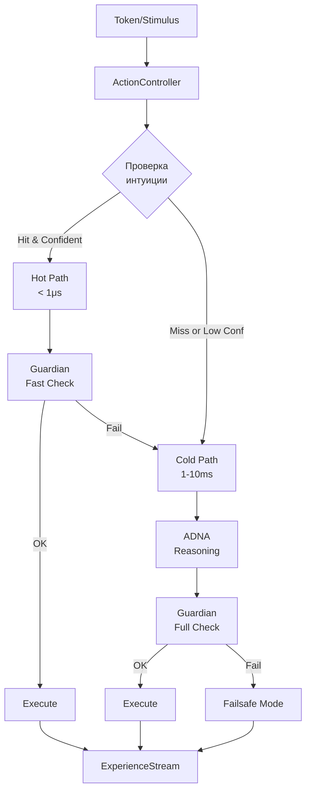
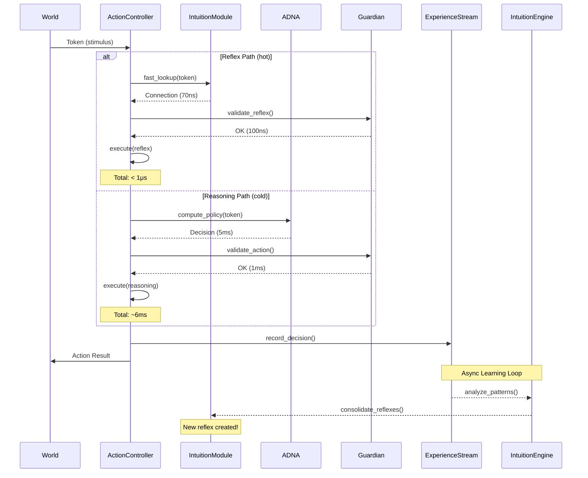

# ActionController v2.0 — Спецификация "Арбитр"

**Версия:** 2.0.0  
**Статус:** Спецификация для реализации  
**Дата:** 2025-01-13  
**Роль:** Исполнительный механизм с двухуровневым принятием решений  
**Зависимости:** IntuitionModule v2.2, ADNA v3.0, Guardian v2.1, ExperienceStream v2.1, Grid v2.0  
**Язык реализации:** Rust

---

## 1. Философия и архитектурная концепция

### 1.1 Проблематика: Конфликт скорости и качества

NeuroGraph OS имеет два механизма принятия решений:

1. **IntuitionModule (System 1)** - Рефлексивная система
   - Скорость: 70-100ns (молниеносно)
   - Основа: HashMap с предвычисленными связями
   - Ограничение: Работает только на знакомых паттернах

2. **ADNA (System 2)** - Аналитическая система
   - Скорость: 1-10ms (медленно)
   - Основа: Полноценный анализ политик и правил
   - Преимущество: Может решать новые задачи

**Дилемма:** Если всегда ждать ADNA - теряем преимущество скорости. Если слепо доверять интуиции - совершаем ошибки в новых ситуациях.

### 1.2 Решение: Арбитражная архитектура

ActionController выступает как **Арбитр** - интеллектуальный диспетчер, который:
- Мгновенно оценивает уверенность в рефлексе
- Принимает решение о пути исполнения
- Обеспечивает безопасность через Guardian
- Записывает контекст решения для обучения

**Ключевой принцип:**
> "Действуй быстро, если уверен. Думай глубоко, если сомневаешься. Всегда соблюдай конституцию (CDNA)."

### 1.3 Три режима работы



---

## 2. Архитектура компонентов

### 2.1 Основная структура

```rust
pub struct ActionController {
    // Ссылки на основные модули
    intuition: Arc<IntuitionModule>,
    adna: Arc<ADNACore>,
    guardian: Arc<Guardian>,
    experience: Arc<ExperienceStream>,
    grid: Arc<Grid>,
    
    // Конфигурация
    config: ArbiterConfig,
    
    // Статистика
    stats: Arc<RwLock<ArbiterStats>>,
    
    // Исполнители действий
    executors: HashMap<ActionType, Arc<dyn ActionExecutor>>,
}
```

### 2.2 Конфигурация арбитра

```rust
#[derive(Debug, Clone, Deserialize, Serialize)]
pub struct ArbiterConfig {
    /// Минимальная уверенность для срабатывания рефлекса (0-255)
    /// Рекомендуемое значение: 200 (~78%)
    pub reflex_confidence_threshold: u8,
    
    /// Режим теневой проверки (для обучения)
    /// Если true, ADNA запускается параллельно для сравнения
    pub shadow_mode: bool,
    
    /// Таймаут ожидания ADNA (миллисекунды)
    pub adna_timeout_ms: u64,
    
    /// Максимальная глубина рекурсии для составных действий
    pub max_action_depth: u8,
    
    /// Включить метрики производительности
    pub enable_metrics: bool,
    
    /// Порог для активации failsafe режима
    pub failsafe_threshold: u8,
}

impl Default for ArbiterConfig {
    fn default() -> Self {
        Self {
            reflex_confidence_threshold: 200,  // ~78%
            shadow_mode: false,
            adna_timeout_ms: 10,
            max_action_depth: 3,
            enable_metrics: true,
            failsafe_threshold: 250,  // ~98%
        }
    }
}
```

### 2.3 Структуры данных для действий

```rust
/// Намерение - высокоуровневое описание желаемого действия
#[derive(Debug, Clone, Serialize, Deserialize)]
pub struct ActionIntent {
    /// Уникальный ID действия
    pub action_id: u32,
    
    /// Тип действия
    pub action_type: ActionType,
    
    /// Параметры действия (8D вектор)
    pub params: [f32; 8],
    
    /// Источник решения
    pub source: DecisionSource,
    
    /// Уверенность в действии (0.0 - 1.0)
    pub confidence: f32,
    
    /// Ожидаемое вознаграждение
    pub estimated_reward: f32,
    
    /// Временная метка создания
    pub timestamp: u64,
}

/// Источник принятия решения
#[derive(Debug, Clone, Serialize, Deserialize)]
pub enum DecisionSource {
    /// Рефлексивное решение (быстрое)
    Reflex {
        connection_id: u64,
        lookup_time_ns: u64,
    },
    
    /// Аналитическое решение (медленное)
    Reasoning {
        policy_version: u32,
        reasoning_time_ms: u64,
    },
    
    /// Аварийное решение
    Failsafe {
        reason: String,
    },
    
    /// Теневое решение (для сравнения)
    Shadow {
        primary: Box<DecisionSource>,
        shadow: Box<DecisionSource>,
    },
}

/// Типы действий в системе
#[derive(Debug, Clone, Copy, PartialEq, Eq, Hash, Serialize, Deserialize)]
pub enum ActionType {
    // Манипуляция токенами
    CreateToken,
    ModifyToken,
    DeleteToken,
    MoveToken,
    
    // Манипуляция связями
    CreateConnection,
    ModifyConnection,
    DeleteConnection,
    
    // Активация и распространение
    ActivateToken,
    PropagateSignal,
    
    // Системные действия
    UpdatePolicy,
    TriggerLearning,
    SaveState,
    
    // Внешние действия (расширяемые)
    External(u32),
}

/// Результат выполнения действия
#[derive(Debug, Clone, Serialize, Deserialize)]
pub struct ActionResult {
    /// Успешность выполнения
    pub success: bool,
    
    /// Результирующие данные
    pub output: serde_json::Value,
    
    /// Измененные токены
    pub modified_tokens: Vec<u32>,
    
    /// Измененные связи
    pub modified_connections: Vec<u64>,
    
    /// Время выполнения
    pub execution_time_ns: u64,
    
    /// Сообщение об ошибке (если есть)
    pub error: Option<String>,
}
```

---

## 3. Алгоритм арбитража (Core Logic)

### 3.1 Главная функция принятия решений

```rust
impl ActionController {
    /// Главный метод: превращает состояние (Token) в действие
    pub async fn act(&self, token: &Token) -> Result<ActionResult, ActionError> {
        let start_time = std::time::Instant::now();
        
        // ============ ФАЗА 1: ПОПЫТКА РЕФЛЕКСА (System 1) ============
        
        // Быстрый поиск в интуиции (70ns)
        if let Some(reflex) = self.intuition.fast_lookup(token) {
            
            // Проверка порога уверенности
            if reflex.confidence >= self.config.reflex_confidence_threshold {
                
                // Конвертация Connection в ActionIntent
                let intent = self.create_reflex_intent(&reflex, token)?;
                
                // Быстрая проверка безопасности (только границы)
                if self.guardian.validate_reflex(&intent).is_ok() {
                    
                    // ИСПОЛНЕНИЕ через рефлекс
                    let result = self.execute_intent(intent.clone()).await?;
                    
                    // Запись в опыт с флагом REFLEX
                    self.record_decision(
                        token,
                        intent,
                        result.clone(),
                        DecisionSource::Reflex {
                            connection_id: reflex.connection_id,
                            lookup_time_ns: start_time.elapsed().as_nanos() as u64,
                        }
                    ).await;
                    
                    // Опциональный shadow mode
                    if self.config.shadow_mode {
                        self.run_shadow_comparison(token).await;
                    }
                    
                    self.update_stats(true, start_time.elapsed());
                    return Ok(result);
                }
                
                // Guardian отклонил рефлекс
                log::debug!(
                    "Reflex rejected by Guardian for token {}, falling back to reasoning",
                    token.id
                );
            }
        }
        
        // ============ ФАЗА 2: АНАЛИТИКА (System 2) ============
        
        // Запускаем полный анализ через ADNA
        let adna_future = self.adna.compute_policy(token);
        
        // Применяем таймаут
        let adna_decision = match timeout(
            Duration::from_millis(self.config.adna_timeout_ms),
            adna_future
        ).await {
            Ok(Ok(decision)) => decision,
            Ok(Err(e)) => {
                log::error!("ADNA computation failed: {:?}", e);
                return self.execute_failsafe("ADNA computation error").await;
            }
            Err(_) => {
                log::warn!("ADNA timeout after {}ms", self.config.adna_timeout_ms);
                return self.execute_failsafe("ADNA timeout").await;
            }
        };
        
        // Конвертация ADNA решения в ActionIntent
        let intent = self.create_reasoning_intent(adna_decision, token)?;
        
        // Полная проверка безопасности
        match self.guardian.validate_action(&intent).await {
            Ok(_) => {
                // ИСПОЛНЕНИЕ через reasoning
                let result = self.execute_intent(intent.clone()).await?;
                
                // Запись в опыт с флагом REASONING
                self.record_decision(
                    token,
                    intent,
                    result.clone(),
                    DecisionSource::Reasoning {
                        policy_version: adna_decision.policy_version,
                        reasoning_time_ms: start_time.elapsed().as_millis() as u64,
                    }
                ).await;
                
                self.update_stats(false, start_time.elapsed());
                Ok(result)
            }
            
            Err(violation) => {
                // ADNA нарушила конституцию
                log::error!("ADNA policy violates CDNA: {:?}", violation);
                self.execute_failsafe(&format!("CDNA violation: {:?}", violation)).await
            }
        }
    }
}
```

### 3.2 Вспомогательные методы

```rust
impl ActionController {
    /// Создание Intent из рефлекса
    fn create_reflex_intent(
        &self, 
        reflex: &IntuitionResult,
        token: &Token
    ) -> Result<ActionIntent, ActionError> {
        
        // Получаем целевой токен
        let target_token = self.grid
            .get(reflex.target_token_id)
            .ok_or(ActionError::TokenNotFound(reflex.target_token_id))?;
        
        // Определяем тип действия по типу связи
        let action_type = match reflex.connection_type {
            ConnectionType::Sequence => ActionType::ActivateToken,
            ConnectionType::Causes => ActionType::PropagateSignal,
            ConnectionType::PartOf => ActionType::MoveToken,
            _ => ActionType::External(0),
        };
        
        // Формируем параметры действия
        let mut params = [0.0_f32; 8];
        
        // Координаты цели (L1-L3)
        for i in 0..3 {
            params[i] = target_token.get_coordinate(CoordinateSpace::L1Physical, i);
        }
        
        // Эмоциональный контекст (L4)
        params[3] = target_token.get_coordinate(CoordinateSpace::L4Emotional, 0);
        
        // Сила/интенсивность из связи
        params[7] = reflex.connection_strength;
        
        Ok(ActionIntent {
            action_id: self.generate_action_id(),
            action_type,
            params,
            source: DecisionSource::Reflex {
                connection_id: reflex.connection_id,
                lookup_time_ns: reflex.lookup_time_ns,
            },
            confidence: reflex.confidence as f32 / 255.0,
            estimated_reward: reflex.expected_reward,
            timestamp: current_timestamp(),
        })
    }
    
    /// Создание Intent из ADNA решения
    fn create_reasoning_intent(
        &self,
        decision: ADNADecision,
        token: &Token
    ) -> Result<ActionIntent, ActionError> {
        Ok(ActionIntent {
            action_id: self.generate_action_id(),
            action_type: decision.recommended_action,
            params: decision.action_parameters,
            source: DecisionSource::Reasoning {
                policy_version: decision.policy_version,
                reasoning_time_ms: decision.computation_time_ms,
            },
            confidence: decision.confidence,
            estimated_reward: decision.expected_value,
            timestamp: current_timestamp(),
        })
    }
    
    /// Выполнение действия через соответствующий Executor
    async fn execute_intent(&self, intent: ActionIntent) -> Result<ActionResult, ActionError> {
        // Находим исполнителя
        let executor = self.executors
            .get(&intent.action_type)
            .ok_or(ActionError::ExecutorNotFound(intent.action_type))?;
        
        // Выполняем
        let start = std::time::Instant::now();
        let result = executor.execute(intent.params).await?;
        
        Ok(ActionResult {
            execution_time_ns: start.elapsed().as_nanos() as u64,
            ..result
        })
    }
    
    /// Аварийный режим
    async fn execute_failsafe(&self, reason: &str) -> Result<ActionResult, ActionError> {
        log::warn!("Entering failsafe mode: {}", reason);
        
        // Простейшее безопасное действие - ничего не делать
        Ok(ActionResult {
            success: false,
            output: json!({
                "failsafe": true,
                "reason": reason
            }),
            modified_tokens: vec![],
            modified_connections: vec![],
            execution_time_ns: 0,
            error: Some(format!("Failsafe: {}", reason)),
        })
    }
    
    /// Запись решения в ExperienceStream
    async fn record_decision(
        &self,
        token: &Token,
        intent: ActionIntent,
        result: ActionResult,
        source: DecisionSource
    ) {
        let event = ExperienceEvent {
            event_type: EventType::ActionTaken,
            state: token.to_state_vector(),
            action: Some(intent.action_id),
            reward: 0.0, // Будет заполнено Appraisers позже
            metadata: json!({
                "source": source,
                "confidence": intent.confidence,
                "execution_time_ns": result.execution_time_ns,
                "success": result.success,
            }),
            timestamp: current_timestamp(),
        };
        
        if let Err(e) = self.experience.write_event(event).await {
            log::error!("Failed to record decision: {:?}", e);
        }
    }
}
```

---

## 4. Интеграция с модулями

### 4.1 IntuitionModule Integration

```rust
/// Результат поиска в интуиции
pub struct IntuitionResult {
    pub connection_id: u64,
    pub target_token_id: u32,
    pub connection_type: ConnectionType,
    pub connection_strength: f32,
    pub confidence: u8,  // 0-255
    pub expected_reward: f32,
    pub lookup_time_ns: u64,
}

/// Расширение IntuitionModule
impl IntuitionModule {
    /// Быстрый поиск рефлекса для токена
    pub fn fast_lookup(&self, token: &Token) -> Option<IntuitionResult> {
        let hash = self.compute_hash(token);
        
        self.reflex_cache
            .get(&hash)
            .filter(|r| r.confidence > 0)  // Только валидные рефлексы
            .cloned()
    }
}
```

### 4.2 Guardian Integration

```rust
/// Расширение Guardian для двухуровневой проверки
impl Guardian {
    /// Быстрая проверка рефлекса (только критические ограничения)
    pub fn validate_reflex(&self, intent: &ActionIntent) -> Result<(), ValidationError> {
        // Проверяем только:
        // - Границы Grid (не выход за пределы)
        // - Базовые ограничения Connection
        // - Критические флаги безопасности
        
        // ~100ns overhead
        self.check_grid_bounds(&intent.params)?;
        self.check_connection_limits(&intent)?;
        Ok(())
    }
    
    /// Полная проверка действия (включая историю и стратегию)
    pub async fn validate_action(&self, intent: &ActionIntent) -> Result<(), ValidationError> {
        // Проверяем всё:
        // - CDNA конституционные правила
        // - История действий (циклы, паттерны)
        // - Ресурсные квоты
        // - Этические ограничения
        // - Стратегическое соответствие
        
        // ~1ms overhead
        self.validate_reflex(intent)?;  // Сначала базовые проверки
        self.check_cdna_compliance(intent).await?;
        self.check_resource_quotas(intent).await?;
        self.check_action_history(intent).await?;
        Ok(())
    }
}
```

### 4.3 ADNA Integration

```rust
/// Решение от ADNA
pub struct ADNADecision {
    pub recommended_action: ActionType,
    pub action_parameters: [f32; 8],
    pub policy_version: u32,
    pub confidence: f32,
    pub expected_value: f32,
    pub computation_time_ms: u64,
    pub reasoning_trace: Vec<String>,  // Для отладки
}

/// Расширение ADNA
impl ADNACore {
    /// Вычисление политики для токена
    pub async fn compute_policy(&self, token: &Token) -> Result<ADNADecision, ADNAError> {
        let start = std::time::Instant::now();
        
        // 1. Извлечение текущих политик
        let policies = self.get_relevant_policies(token).await?;
        
        // 2. Оценка каждой политики
        let evaluations = self.evaluate_policies(policies, token).await?;
        
        // 3. Выбор лучшей политики
        let best_policy = self.select_best_policy(evaluations)?;
        
        // 4. Генерация параметров действия
        let params = self.generate_action_params(best_policy, token)?;
        
        Ok(ADNADecision {
            recommended_action: best_policy.action_type,
            action_parameters: params,
            policy_version: best_policy.version,
            confidence: best_policy.confidence,
            expected_value: best_policy.expected_reward,
            computation_time_ms: start.elapsed().as_millis() as u64,
            reasoning_trace: best_policy.trace,
        })
    }
}
```

---

## 5. Система исполнителей (Executors)

### 5.1 Базовый trait

```rust
#[async_trait]
pub trait ActionExecutor: Send + Sync {
    /// Уникальный ID исполнителя
    fn id(&self) -> &str;
    
    /// Поддерживаемые типы действий
    fn supported_actions(&self) -> Vec<ActionType>;
    
    /// Выполнение действия
    async fn execute(&self, params: [f32; 8]) -> Result<ActionResult, ExecutionError>;
    
    /// Валидация параметров перед выполнением
    fn validate_params(&self, params: &[f32; 8]) -> Result<(), ValidationError> {
        Ok(()) // По умолчанию - всё валидно
    }
}
```

### 5.2 Примеры исполнителей

```rust
/// Исполнитель для манипуляции токенами
pub struct TokenExecutor {
    grid: Arc<Grid>,
}

#[async_trait]
impl ActionExecutor for TokenExecutor {
    fn id(&self) -> &str {
        "token_executor"
    }
    
    fn supported_actions(&self) -> Vec<ActionType> {
        vec![
            ActionType::CreateToken,
            ActionType::ModifyToken,
            ActionType::DeleteToken,
            ActionType::MoveToken,
        ]
    }
    
    async fn execute(&self, params: [f32; 8]) -> Result<ActionResult, ExecutionError> {
        // params[0..3] - координаты
        // params[3] - entity_type
        // params[4] - weight
        // params[5..7] - field parameters
        // params[7] - intensity
        
        let mut token = Token::new(self.grid.generate_id());
        token.set_coordinates(
            CoordinateSpace::L1Physical,
            params[0], params[1], params[2]
        );
        
        self.grid.add(token)?;
        
        Ok(ActionResult {
            success: true,
            output: json!({ "token_id": token.id }),
            modified_tokens: vec![token.id],
            modified_connections: vec![],
            execution_time_ns: 1000, // Примерно
            error: None,
        })
    }
}

/// Исполнитель для активации и распространения сигналов
pub struct SignalExecutor {
    grid: Arc<Grid>,
    graph: Arc<Graph>,
}

#[async_trait]
impl ActionExecutor for SignalExecutor {
    fn id(&self) -> &str {
        "signal_executor"
    }
    
    fn supported_actions(&self) -> Vec<ActionType> {
        vec![
            ActionType::ActivateToken,
            ActionType::PropagateSignal,
        ]
    }
    
    async fn execute(&self, params: [f32; 8]) -> Result<ActionResult, ExecutionError> {
        // params[0] - token_id (encoded as float)
        // params[1] - activation_strength
        // params[2] - propagation_depth
        // params[3..8] - дополнительные параметры
        
        let token_id = params[0] as u32;
        let strength = params[1];
        let depth = params[2] as usize;
        
        // Активация токена
        let activated = self.graph.spreading_activation(
            token_id,
            strength,
            depth
        ).await?;
        
        Ok(ActionResult {
            success: true,
            output: json!({
                "activated_tokens": activated.len(),
                "max_activation": activated.iter().map(|a| a.strength).max(),
            }),
            modified_tokens: activated.iter().map(|a| a.token_id).collect(),
            modified_connections: vec![],
            execution_time_ns: 10000, // Примерно
            error: None,
        })
    }
}
```

---

## 6. Метрики и мониторинг

### 6.1 Статистика работы

```rust
#[derive(Debug, Default)]
pub struct ArbiterStats {
    /// Количество рефлексивных решений
    pub reflex_decisions: u64,
    
    /// Количество аналитических решений
    pub reasoning_decisions: u64,
    
    /// Количество failsafe активаций
    pub failsafe_activations: u64,
    
    /// Средняя уверенность рефлексов
    pub avg_reflex_confidence: f32,
    
    /// Средняя уверенность ADNA
    pub avg_reasoning_confidence: f32,
    
    /// Среднее время рефлекса (ns)
    pub avg_reflex_time_ns: u64,
    
    /// Среднее время reasoning (ms)
    pub avg_reasoning_time_ms: u64,
    
    /// Процент использования рефлексов
    pub reflex_usage_percent: f32,
    
    /// Количество отклонений Guardian
    pub guardian_rejections: u64,
}

impl ActionController {
    /// Обновление статистики
    fn update_stats(&self, was_reflex: bool, elapsed: Duration) {
        let mut stats = self.stats.write().unwrap();
        
        if was_reflex {
            stats.reflex_decisions += 1;
            stats.avg_reflex_time_ns = 
                (stats.avg_reflex_time_ns * (stats.reflex_decisions - 1) + 
                 elapsed.as_nanos() as u64) / stats.reflex_decisions;
        } else {
            stats.reasoning_decisions += 1;
            stats.avg_reasoning_time_ms = 
                (stats.avg_reasoning_time_ms * (stats.reasoning_decisions - 1) + 
                 elapsed.as_millis() as u64) / stats.reasoning_decisions;
        }
        
        let total = stats.reflex_decisions + stats.reasoning_decisions;
        stats.reflex_usage_percent = 
            (stats.reflex_decisions as f32 / total as f32) * 100.0;
    }
    
    /// Получение метрик
    pub fn get_metrics(&self) -> ArbiterStats {
        self.stats.read().unwrap().clone()
    }
}
```

### 6.2 Shadow Mode для обучения

```rust
impl ActionController {
    /// Теневое сравнение решений
    async fn run_shadow_comparison(&self, token: &Token) {
        // Запускаем ADNA в фоне для сравнения
        let adna_handle = tokio::spawn({
            let adna = self.adna.clone();
            let token = token.clone();
            async move {
                adna.compute_policy(&token).await
            }
        });
        
        // Не ждём результат, просто логируем для анализа
        tokio::spawn(async move {
            if let Ok(Ok(adna_decision)) = adna_handle.await {
                log::info!(
                    "Shadow comparison: ADNA would have chosen {:?} with confidence {}",
                    adna_decision.recommended_action,
                    adna_decision.confidence
                );
            }
        });
    }
}
```

---

## 7. Обработка ошибок

```rust
#[derive(Debug, thiserror::Error)]
pub enum ActionError {
    #[error("Token not found: {0}")]
    TokenNotFound(u32),
    
    #[error("Executor not found for action type: {0:?}")]
    ExecutorNotFound(ActionType),
    
    #[error("Execution failed: {0}")]
    ExecutionError(#[from] ExecutionError),
    
    #[error("Validation failed: {0}")]
    ValidationError(#[from] ValidationError),
    
    #[error("ADNA error: {0}")]
    ADNAError(#[from] ADNAError),
    
    #[error("Guardian rejection: {0}")]
    GuardianRejection(String),
    
    #[error("Timeout waiting for decision")]
    Timeout,
    
    #[error("System error: {0}")]
    SystemError(String),
}
```

---

## 8. Тестирование

### 8.1 Главный E2E тест "Light Speed"

```rust
#[tokio::test]
async fn test_reflex_acceleration() {
    let controller = create_test_controller();
    let token = create_test_token();
    
    // 1. Cold Start - первый запуск
    let start = Instant::now();
    let result1 = controller.act(&token).await.unwrap();
    let cold_time = start.elapsed();
    
    // Ожидаем reasoning путь (>1ms)
    assert!(cold_time.as_millis() > 1);
    assert_eq!(result1.metadata["source"]["type"], "Reasoning");
    
    // 2. Ждём консолидацию в IntuitionEngine
    tokio::time::sleep(Duration::from_millis(100)).await;
    
    // 3. Hot Start - повторный запуск
    let start = Instant::now();
    let result2 = controller.act(&token).await.unwrap();
    let hot_time = start.elapsed();
    
    // Ожидаем reflex путь (<1μs)
    assert!(hot_time.as_micros() < 1);
    assert_eq!(result2.metadata["source"]["type"], "Reflex");
    
    // 4. Проверяем ускорение
    let speedup = cold_time.as_nanos() / hot_time.as_nanos();
    assert!(speedup > 1000); // Минимум 1000x ускорение
    
    println!("Cold: {:?}, Hot: {:?}, Speedup: {}x", 
             cold_time, hot_time, speedup);
}
```

### 8.2 Тест Guardian отклонения

```rust
#[tokio::test]
async fn test_guardian_rejection_fallback() {
    let controller = create_test_controller();
    
    // Создаём токен, который вызовет опасное действие
    let dangerous_token = create_dangerous_token();
    
    // Добавляем рефлекс для этого токена
    controller.intuition.add_reflex(
        dangerous_token.hash(),
        create_dangerous_connection()
    );
    
    // Действуем
    let result = controller.act(&dangerous_token).await.unwrap();
    
    // Guardian должен отклонить рефлекс и переключиться на ADNA
    assert_eq!(result.metadata["source"]["type"], "Reasoning");
    assert!(result.metadata["guardian_rejected_reflex"]);
}
```

### 8.3 Тест failsafe режима

```rust
#[tokio::test]
async fn test_failsafe_activation() {
    let mut controller = create_test_controller();
    
    // Устанавливаем очень короткий таймаут
    controller.config.adna_timeout_ms = 1;
    
    // Создаём сложный токен, требующий долгого анализа
    let complex_token = create_complex_token();
    
    // Действуем
    let result = controller.act(&complex_token).await.unwrap();
    
    // Должен сработать failsafe из-за таймаута
    assert!(!result.success);
    assert_eq!(result.metadata["source"]["type"], "Failsafe");
    assert!(result.error.unwrap().contains("timeout"));
}
```

---

## 9. Замыкание цикла обучения

### 9.1 Полный цикл



### 9.2 Эволюционный процесс

1. **Начало:** Система не знает паттерн → использует ADNA (медленно)
2. **Опыт:** ActionController записывает успешное решение в ExperienceStream
3. **Анализ:** IntuitionEngine находит повторяющийся паттерн
4. **Консолидация:** Создается новый рефлекс в IntuitionModule
5. **Ускорение:** При повторе паттерна срабатывает рефлекс (быстро)
6. **Оптимизация:** ADNA политики обновляются на основе статистики рефлексов

---

## 10. Конфигурация и развертывание

### 10.1 Конфигурационный файл

```toml
# action_controller.toml

[arbiter]
reflex_confidence_threshold = 200  # ~78%
shadow_mode = false                # Включить для обучения
adna_timeout_ms = 10               # Максимум 10ms на решение
max_action_depth = 3               # Глубина составных действий
enable_metrics = true              # Сбор статистики
failsafe_threshold = 250           # ~98% для аварийного режима

[executors]
token_executor = true
connection_executor = true
signal_executor = true
policy_executor = false  # Отключен по умолчанию

[guardian]
fast_check_enabled = true
fast_check_timeout_us = 100  # 100 микросекунд
full_check_timeout_ms = 5     # 5 миллисекунд

[metrics]
export_interval_sec = 10
export_format = "prometheus"
export_endpoint = "http://localhost:9090/metrics"
```

### 10.2 Инициализация

```rust
pub async fn create_action_controller(
    config_path: &str
) -> Result<ActionController, Box<dyn std::error::Error>> {
    
    // Загрузка конфигурации
    let config = ArbiterConfig::from_file(config_path)?;
    
    // Создание модулей
    let intuition = Arc::new(IntuitionModule::new());
    let adna = Arc::new(ADNACore::new());
    let guardian = Arc::new(Guardian::new());
    let experience = Arc::new(ExperienceStream::new());
    let grid = Arc::new(Grid::new());
    
    // Создание исполнителей
    let mut executors = HashMap::new();
    executors.insert(
        ActionType::CreateToken,
        Arc::new(TokenExecutor::new(grid.clone())) as Arc<dyn ActionExecutor>
    );
    executors.insert(
        ActionType::PropagateSignal,
        Arc::new(SignalExecutor::new(grid.clone(), graph.clone())) as Arc<dyn ActionExecutor>
    );
    
    // Создание контроллера
    let controller = ActionController {
        intuition,
        adna,
        guardian,
        experience,
        grid,
        config,
        stats: Arc::new(RwLock::new(ArbiterStats::default())),
        executors,
    };
    
    Ok(controller)
}
```

---

## 11. Производительность и оптимизации

### 11.1 Целевые метрики

```yaml
Reflex Path (System 1):
  Lookup:           70ns
  Validation:       100ns
  Execution:        100-500ns
  Recording:        100ns (async)
  TOTAL:           < 1μs

Reasoning Path (System 2):
  Policy compute:   1-5ms
  Validation:       0.5-1ms
  Execution:        100-500ns
  Recording:        100ns (async)
  TOTAL:           2-7ms

Memory:
  Controller:       ~1KB
  Reflex cache:     ~100MB (1M reflexes)
  ADNA policies:    ~10MB
  Statistics:       ~1KB

Throughput:
  Reflex mode:      1M+ decisions/sec
  Reasoning mode:   100-500 decisions/sec
  Mixed (80/20):    800K decisions/sec
```

### 11.2 Оптимизации

1. **Lock-free структуры** для reflex cache
2. **SIMD инструкции** для векторных операций
3. **Memory pooling** для ActionIntent/ActionResult
4. **Batch recording** в ExperienceStream
5. **CPU affinity** для hot path потоков

---

## 12. Roadmap развития

### v2.1 - Advanced Reflexes
- Композитные рефлексы (цепочки действий)
- Контекстно-зависимые рефлексы
- Вероятностные рефлексы

### v2.2 - Multi-agent
- Координация между несколькими ActionController
- Распределенное принятие решений
- Консенсус-механизмы

### v3.0 - Neural Integration
- Нейросетевые политики вместо rule-based
- End-to-end обучение
- Differentiable действия

---

## Заключение

ActionController v2.0 "Арбитр" - это критический компонент, который превращает NeuroGraph OS в настоящую автономную систему. Двухуровневая архитектура (рефлексы + reasoning) обеспечивает оптимальный баланс между скоростью реакции и качеством решений.

**Ключевые достижения:**
- ⚡ Субмикросекундные рефлексы (< 1μs)
- 🧠 Интеллектуальный fallback на аналитику
- 🛡️ Двухуровневая система безопасности
- 📊 Полная observability через ExperienceStream
- 🔄 Автоматическое обучение новым рефлексам

Система готова к реализации и интеграции с существующими модулями NeuroGraph OS.

---

**NeuroGraph OS ActionController v2.0**  
*"Act fast when confident. Think deep when uncertain. Always obey the law."*
